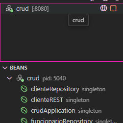

# LavanderiaOnLine
Sistema de gestão de uma lavanderia que coleta as roupas diretamente na casa do cliente atraves do pedido realizado na plataforma.
O sistema possui armazenamento de daos de clientes, funcionarios, gerenciamento de pedidos e registro de pagamento do mesmo, além de ser possível gerar relatorios do periodo desejado. 

# Requisitos 
* Este projeto foi gerado com [Angular CLI](https://github.com/angular/angular-cli) versão v17.2.3.
* Versão do Node v20.10.0
* Versão do java  v21.0.4

# iniciando o projeto

Ao baixar o repositorio rode
`````
npm intall
``````
## Servidor de desenvolvimento
Para iniciar o servidor angular digite no terminal e navegue ate o endereço `http://localhost:4200/`.
`````
ng serve
`````
 A aplicação ira atualizar automaticamente a todas as alterações no projeto.

## Rodando o Back-End
Com a extensão instalado nas dependencias do vsCode, inicie o servidor. Você vera algo como isso na aba da extensão.



## Avisos
Ao iniciar o programa nenhum dado estara cadastrado, utilize o postman ou outro program de sua escolha para adicionar o seguinte funcionário mestre.
url para o cadastro de funcionario : http://localhost:8080/Funcionario
`````
 {
    "id": 1,
    "login": "menfislab@gmail.com",
    "nome": "324242",
    "nascimento": "08/08/2024",
    "senha": "0000"
},
`````
## Mais ajuda

Para obter mais ajuda sobre o Angular CLI, use `ng help` ou confira a página [Visão geral e referência de comando do Angular CLI](https://angular.io/cli).

